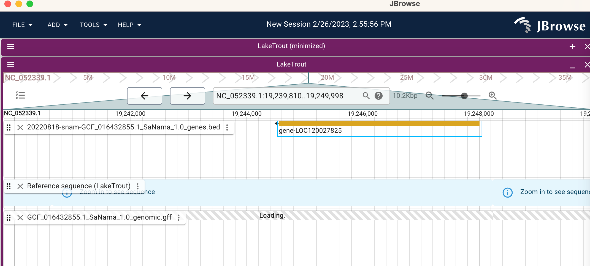

gene-explore
================

## C1Q

``` bash
fgrep "LOC120027825" /Users/sr320/Downloads/GCF_016432855.1_SaNama_1.0_genomic.gff
```

    NC_052339.1 Gnomon  gene    19244556    19248013    .   -   .   ID=gene-LOC120027825;Dbxref=GeneID:120027825;Name=LOC120027825;gbkey=Gene;gene=LOC120027825;gene_biotype=protein_coding
    NC_052339.1 Gnomon  mRNA    19244556    19248013    .   -   .   ID=rna-XM_038972874.1;Parent=gene-LOC120027825;Dbxref=GeneID:120027825,Genbank:XM_038972874.1;Name=XM_038972874.1;gbkey=mRNA;gene=LOC120027825;model_evidence=Supporting evidence includes similarity to: 100%25 coverage of the annotated genomic feature by RNAseq alignments%2C including 54 samples with support for all annotated introns;product=complement C1q-like protein 2;transcript_id=XM_038972874.1
    NC_052339.1 Gnomon  exon    19247702    19248013    .   -   .   ID=exon-XM_038972874.1-1;Parent=rna-XM_038972874.1;Dbxref=GeneID:120027825,Genbank:XM_038972874.1;gbkey=mRNA;gene=LOC120027825;product=complement C1q-like protein 2;transcript_id=XM_038972874.1
    NC_052339.1 Gnomon  exon    19247453    19247581    .   -   .   ID=exon-XM_038972874.1-2;Parent=rna-XM_038972874.1;Dbxref=GeneID:120027825,Genbank:XM_038972874.1;gbkey=mRNA;gene=LOC120027825;product=complement C1q-like protein 2;transcript_id=XM_038972874.1
    NC_052339.1 Gnomon  exon    19244556    19244985    .   -   .   ID=exon-XM_038972874.1-3;Parent=rna-XM_038972874.1;Dbxref=GeneID:120027825,Genbank:XM_038972874.1;gbkey=mRNA;gene=LOC120027825;product=complement C1q-like protein 2;transcript_id=XM_038972874.1
    NC_052339.1 Gnomon  CDS 19247702    19247924    .   -   0   ID=cds-XP_038828802.1;Parent=rna-XM_038972874.1;Dbxref=GeneID:120027825,Genbank:XP_038828802.1;Name=XP_038828802.1;gbkey=CDS;gene=LOC120027825;product=complement C1q-like protein 2;protein_id=XP_038828802.1
    NC_052339.1 Gnomon  CDS 19247453    19247581    .   -   2   ID=cds-XP_038828802.1;Parent=rna-XM_038972874.1;Dbxref=GeneID:120027825,Genbank:XP_038828802.1;Name=XP_038828802.1;gbkey=CDS;gene=LOC120027825;product=complement C1q-like protein 2;protein_id=XP_038828802.1
    NC_052339.1 Gnomon  CDS 19244702    19244985    .   -   2   ID=cds-XP_038828802.1;Parent=rna-XM_038972874.1;Dbxref=GeneID:120027825,Genbank:XP_038828802.1;Name=XP_038828802.1;gbkey=CDS;gene=LOC120027825;product=complement C1q-like protein 2;protein_id=XP_038828802.1

    NC_052339.1 Gnomon  gene    19244556    19248013    .   -   .   ID=gene-LOC120027825;Dbxref=GeneID:120027825;Name=LOC120027825;gbkey=Gene;gene=LOC120027825;gene_biotype=protein_coding

``` r
19248013-19244556
```

    [1] 3457


