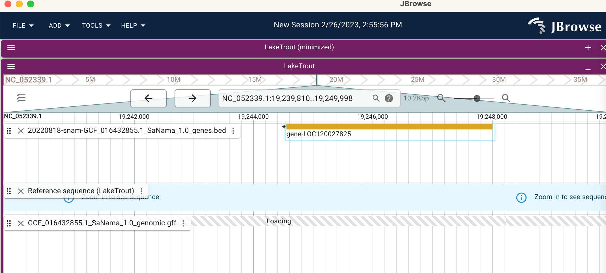

## Goal

Surface the gene-anchored synteny between the **lean** and **siscowet** ecotypes
([21.1-gene-anchored-synteny](21.1-gene-anchored-synteny.Rmd)), together with per-gene
functional annotation ([20.1-liftoff-annotation](20.1-liftoff-annotation.Rmd)), inside the
two interactive genome browsers already on the project site — [IGV.js](../genome-browser/index.html)
and [JBrowse 2](../jbrowse/index.html). Full plan: [22-synteny-browser-integration-plan.md](22-synteny-browser-integration-plan.md).

Two complementary paths, both now shipped:

- **Path A — reference-anchored tracks.** Project synteny + annotation onto the reference
  SaNama_1.0 coordinates so they show up as ordinary tracks alongside the existing PAV and
  methylation tracks, in both browsers.
- **Path B — JBrowse 2 Linear Synteny View.** Declare the ecotype assemblies natively and
  render lean vs. siscowet stacked with connecting synteny ribbons — inversions and
  rearrangements visible directly.

## Key coordinate gotchas

- Liftoff assigns the same reference `gene-LOC…` ID to orthologs across assemblies, so
  synteny anchors are gene-ID identity and every ecotype gene maps back to a reference locus.
- MCScanX needs sanitized chromosome names (`NC_052308.1` → `rfNC0523081`,
  `ptg000001l_1` → `lnptg000001l1`); any reference-anchored track has to be **un-sanitized**
  back to `NC_0523xx.1` to line up with the browser sequence.
- Liftoff `-copies` appends `_N` (e.g. `gene-LOC120041454_1`); strip it for base-ID joins.

## Phase 1 (Path A) — reference-anchored tracks

Built by [22-synteny-browser-tracks.py](22-synteny-browser-tracks.py), outputs in
`output/22-synteny-browser-tracks/`, staged into `genome-browser/data/synteny/` and
`jbrowse/data/lake-trout/`.

```{bash}
#| eval: false
python code/22-synteny-browser-tracks.py
```

- **`genes_annotated.gff3`** — 46,359 reference genes, 45,069 with `symbol`/`product`/
  `biotype`/GO terms plus an `ecotypes=` tag showing lean/siscowet presence. Built from the
  liftoff `gene_function_table.tsv`, keyed on reference locus, un-sanitized back to
  `NC_0523xx.1`.
- **`synteny_lean_blocks.bed`** — 1,897 blocks. **`synteny_siscowet_blocks.bed`** — 1,966
  blocks. One BED feature per synteny block: name = `ecotype:contig|block#|n=anchors`,
  score scaled from anchor count, strand = orientation (`-` = inversion relative to
  reference).

Wired into `genome-browser/js/config.js` (`TRACK_CONFIGS`/`DEFAULT_TRACKS`) and
`jbrowse/config.json` (`FeatureTrack`s under `category: ["Synteny"]`).

## Phase 2 (Path B) — JBrowse 2 Linear Synteny View, lean ↔ siscowet

Built by [22.2-jbrowse-synteny-view.py](22.2-jbrowse-synteny-view.py), converting the
`lean_sisco.collinearity` MCScanX output into the file trio JBrowse's
`MCScanAnchorsAdapter` needs.

```{bash}
#| eval: false
python code/22.2-jbrowse-synteny-view.py
```

- **`lean_siscowet.anchors`** — 4,113 blocks / 77,628 anchor pairs (jcvi/MCScan format).
- **`lean_purged.mcscan.bed`** — 55,437 genes. **`siscowet_purged.mcscan.bed`** — 59,968
  genes. Chromosome names un-sanitized against each assembly's `.fai` so BED coordinates
  match the FASTA exactly (verified: 0 mismatches).

`jbrowse/config.json` now declares `lean_purged` + `siscowet_purged` assemblies (FASTA
streamed from Gannet, `.fai` served locally), a `SyntenyTrack`, and a gene `FeatureTrack`
per ecotype. Open via JBrowse's **Linear synteny view**, selecting the two ecotype
assemblies plus the *Lean ↔ Siscowet synteny* track.

## Where to look

<a href="../genome-browser/index.html">IGV.js browser</a> — quick exploration: annotated
genes, lean/siscowet synteny blocks, PAV, methylation.

<a href="../jbrowse/index.html">JBrowse 2 browser</a> — same reference-anchored tracks, plus
the native lean ↔ siscowet Linear Synteny View.

```{r jb, echo = FALSE, out.width = "70%", fig.align = "center"}

```

## Remaining / Phase 3

- Ship a pre-built Linear Synteny **saved session** so the browser link opens straight into
  the lean-vs-siscowet ribbon view.
- Optionally add `ref↔lean` / `ref↔sisco` synteny tracks the same way.
- Breakpoint/rearrangement track (Path A3) marking reference intervals where lean and
  siscowet contigs disagree — candidate structural-rearrangement sites.
- Polish: track colors, feature-detail formatting, GO term links out.
