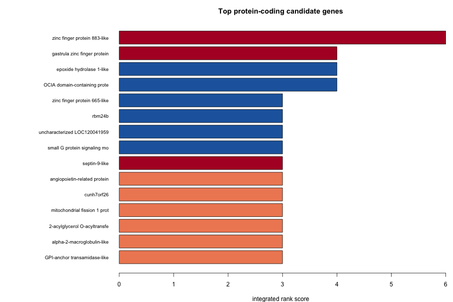

> **Note:** The published landing page (`index.html`) is a hand-authored, self-contained
> page. This `.qmd` mirrors its content as the editable source. If you re-render with Quarto,
> review the result against `index.html` before publishing so the polished layout is preserved.

```{=html}
<style>
.stat-box{background:linear-gradient(135deg,#0e7490 0%,#155e75 100%);color:#fff;padding:1rem;
  border-radius:8px;text-align:center;margin:.5rem;flex:1;min-width:150px}
.stat-number{font-size:2rem;font-weight:bold}
.stats-container{display:flex;flex-wrap:wrap;justify-content:center;gap:1rem;margin:2rem 0}
.lean-color{color:#1d4ed8;font-weight:700}.siscowet-color{color:#c2410c;font-weight:700}
.finding-box{background:#f0f9ff;border-left:4px solid #0ea5e9;padding:1rem;margin:1rem 0;border-radius:0 8px 8px 0}
.warn-box{background:#fff7ed;border-left:4px solid #f59e0b;padding:1rem;margin:1rem 0;border-radius:0 8px 8px 0}
.browser-link{display:inline-block;background:linear-gradient(135deg,#0e7490 0%,#155e75 100%);
  color:#fff !important;padding:.75rem 1.5rem;border-radius:8px;text-decoration:none;font-weight:600}
</style>
```

## Two Ecotypes, One Lake System

Lake trout (*Salvelinus namaycush*) in the Great Lakes occur as divergent ecotypes that share
water but not lifestyle:

- **<span class="lean-color">Lean</span>**: shallow-water dwelling, elongate body, low lipid content
- **<span class="siscowet-color">Siscowet</span>**: deep-water specialist, robust body, high lipid storage

This project asks a focused question: **which genes carry the epigenetic and structural differences
between the ecotypes, and what phenotypes might they shape?** Earlier stages produced the raw
differences — differentially methylated regions (DMRs) and presence–absence variants (PAVs). The
work featured here adds the missing interpretive layer: a genome-wide **functional annotation** that
turns coordinates into gene names, products, and Gene Ontology terms, then ranks candidates and
reasons — carefully — about phenotype.

```{=html}
<div class="stats-container">
  <div class="stat-box"><div class="stat-number">302</div>Differentially methylated regions</div>
  <div class="stat-box"><div class="stat-number">3,465</div>High-confidence siscowet deletions</div>
  <div class="stat-box"><div class="stat-number">2,036</div>Annotated candidate genes</div>
  <div class="stat-box"><div class="stat-number">4</div>Convergent (methylation + PAV)</div>
</div>
```

::: {.finding-box}
**Read this as hypothesis-generating.** Every link below is an *association* on a single
lean-background reference genome — no functional validation, and no single CpG survives genome-wide
multiple-testing correction. The value is a ranked, annotated shortlist, not a causal claim.
:::

---

## How the Evidence Stacks: Three Integrated Layers

### Differential methylation

- **540,040** CpG sites tested
- **302** DMRs (20 hyper- / 282 hypo-methylated in siscowet)
- **149** DMRs within 5 kb of a gene; **88** in promoters
- 0 single CpGs survive q < 0.1 — lead with the DMR level

### Presence–absence variation (PAV)

- **3,465** stringent siscowet-specific deletions (>100 bp, all-4-vs-none)
- **1,543** within 5 kb of a gene; **54** overlap an exon (candidate copy/LOF changes)
- Reference-bias aware: a lean-background genome inflates siscowet deletions

### Functional annotation *(new)*

- **46,359** genes annotated from NCBI RefSeq
- **46,231** with a product description; **34,367** with ≥1 Gene Ontology term
- The join key that turns variants into interpretable candidates

See [`analyses/18-annotation/README.md`](analyses/18-annotation/README.md) for the annotation
methods and provenance.

---

## Convergent & Top-Ranked Candidate Genes

Genes were ranked by convergence (methylation *and* deletion), promoter/exon placement, expression
support, and methylation↔expression concordance. The four **convergent** loci — carrying both a DMR
and a high-confidence siscowet deletion — are the strongest candidates.

| Gene | Product | Methylation | Deletion | Note |
|---|---|---|---|---|
| `znf883-like` (LOC120032414) | Zinc finger protein 883-like | exon · hyper | exonic | **top convergent** |
| `XlCGF57.1-like` (LOC120040411) | Gastrula zinc finger protein XlCGF57.1-like | intron · hypo | nearby | convergent |
| `septin-9-like` (LOC120043843) | Septin-9-like | intron · hyper | nearby | convergent |
| LOC120039781 | Uncharacterized locus | intron · hypo | nearby | convergent |
| `angptl5` | Angiopoietin-related protein 5-like | — | exonic | lipid axis |
| `mogat2` | 2-acylglycerol O-acyltransferase 2-A-like | — | exonic | lipid axis |
| `ephx1-like` | Epoxide hydrolase 1-like | promoter | — | lipid / xenobiotic |

{fig-alt="Top candidate genes bar chart" width="100%"}

Source: [`integrated_candidate_genes.tsv`](analyses/18-annotation/integrated_candidate_genes.tsv).

### Gene Ontology enrichment (deletion set)

| GO term | Fold | FDR | Read as |
|---|---|---|---|
| Calcium ion transmembrane transport | 3.7 | 5.6×10⁻⁴ | most defensible signal |
| Neuron projection development | 2.4 | 2.6×10⁻³ | sensory / neural |
| Calcium channel complex | 4.6 | 3.0×10⁻³ | length-bias caveat |
| Calcium ion transport | 3.0 | 3.0×10⁻³ | ion homeostasis |
| Lipid / phospholipid binding | 1.5 | ns (0.3) | suggestive only |

Hypergeometric over-representation vs. all GO-annotated genes (BH-FDR). The DMR set's enrichment is
dominated by a single histone cluster and adjacent `znf883` paralogs — a tandem-cluster artifact, not
broad convergence. Full tables:
[PAV](analyses/18-annotation/go_enrichment_pav.tsv),
[DMR](analyses/18-annotation/go_enrichment_dmr.tsv),
[union](analyses/18-annotation/go_enrichment_union.tsv).

---

## Hypothesized Links to Ecotype Biology

Each axis pairs annotated candidate genes with a known or measured difference between the ecotypes.
These are **hypotheses** anchored to morphometric data, not validated mechanisms.

- **🫧 Lipid & energy storage** — exonic siscowet deletions in `angptl5`, `mogat2`, and a promoter
  DMR at epoxide hydrolase 1 touch lipid handling, consistent with the defining high-lipid siscowet
  phenotype and deep-water buoyancy.
- **🐠 Body shape, growth & muscle** — methylation-led candidates including `rbm24b` (muscle/cardiac
  splicing) and growth-associated GO terms align with the elongate-lean vs. robust-siscowet contrast
  captured in the 17-landmark morphometric data.
- **⚡ Calcium / sensory-neural** — calcium-transport and neuron-projection GO enrichment in the
  deletion set hints at sensory or excitability differences relevant to a deep, dark, high-pressure
  habitat (length-bias-aware).
- **🛡️ Immune & adhesion** — exonic deletions hit immune/adhesion genes (alpha-2-macroglobulin,
  CEACAM, DMBT1); some signal is real divergence, some reflects rapidly evolving, reference-divergent
  families.

Full write-up: [`code/18-diff-annotation-phenotype.html`](code/18-diff-annotation-phenotype.html).

---

## Interactive Genome Browsers

Explore methylation, PAV, gene, and ecotype-synteny tracks directly across the SaNama_1.0 assembly.
Genes now carry functional annotation (symbol, product, GO terms, and which ecotypes retain them),
and lean/siscowet **synteny blocks** are projected onto the reference so you can see, at any locus,
which ecotype contig maps there and whether it is inverted.

::: {.columns}
::: {.column width="50%"}
### 🔬 IGV.js — *quick exploration*
Functionally-annotated genes · lean & siscowet synteny blocks · PAV insertions & deletions · CpG methylation (8 samples) · DMRs

<a href="genome-browser/index.html" class="browser-link">Launch IGV Browser →</a>
:::
::: {.column width="50%"}
### 🧬 JBrowse 2 — *advanced analysis*
Functionally-annotated genes (GFF3) · lean & siscowet synteny blocks · PAV structural variants · CpG methylation · differential methylation

<a href="jbrowse/index.html" class="browser-link">Launch JBrowse 2 →</a>
:::
:::

---

## Interpretation Guardrails

This analysis is deliberately conservative. The constraints below shape every claim above and are
baked into the candidate rankings.

::: {.warn-box}
**The reference is a lean-background genome.** SaNama_1.0 was built from a doubled-haploid Seneca Lake
(lean-morphotype) fish. Siscowet diverges more from it, so siscowet reads map less completely —
inflating apparent siscowet-specific deletions and reducing methylation power in the most divergent
regions. Siscowet and lean variant counts are *not* magnitude-comparable.
:::

::: {.warn-box}
**No single CpG survives genome-wide correction** (0 DMCs at q < 0.1). Interpretation leads with
DMR-level and stringent-PAV sets; single-CpG and lenient-PAV hits are hypothesis-generating only.
:::

::: {.warn-box}
**Expression support is weak by design.** The liver RNA-seq is from a separate parasite study with
different individuals — orthogonal support, never confirmation.
:::

::: {.warn-box}
**Enrichment confounders.** The PAV GO signal carries a gene-length bias (long calcium/ion-channel
genes accumulate deletions by chance); the DMR GO signal is a tandem-cluster artifact. Associations,
not causation — no functional validation was performed.
:::

---

## Data & Methods

### Reference Genome
- **Assembly**: NCBI [GCF_016432855.1 (SaNama_1.0)](https://www.ncbi.nlm.nih.gov/datasets/genome/GCF_016432855.1/)
- **Source**: NCBI BioProject [PRJNA674328](https://www.ncbi.nlm.nih.gov/bioproject/?term=PRJNA674328)
- **Annotation**: NCBI RefSeq GFF + GO (GAF)

### Samples
| Ecotype | Sample Size | Description |
|---------|-------------|-------------|
| **Lean** | n=4 | Shallow-water ecotype (PacBio HiFi) |
| **Siscowet** | n=4 | Deep-water ecotype (PacBio HiFi) |

### Analysis Pipeline
1. PacBio HiFi sequencing with 5mC modification calling
2. CpG methylation profiling & DMR identification
3. Coverage/CIGAR-based PAV detection (lenient + stringent tiers)
4. RefSeq functional annotation backbone (gene → product → GO)
5. Strand-aware DMR/PAV-to-gene assignment (promoter ±2 kb, flank ±5 kb)
6. Hypergeometric GO over-representation with BH-FDR

---

## Citation & Resources

- **GitHub Repository**: [RobertsLab/project-lake-trout](https://github.com/RobertsLab/project-lake-trout)
- **Annotation plan**: [`code/18-diff-annotation-phenotype-plan.md`](code/18-diff-annotation-phenotype-plan.md)
