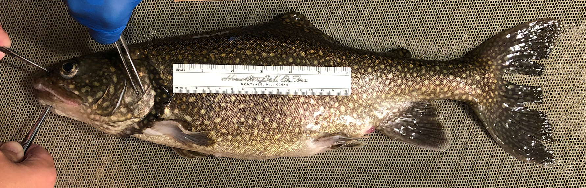

```{=html}
<style>
.genome-browser-card {
  border: 2px solid #e0e0e0;
  border-radius: 12px;
  padding: 1.5rem;
  margin: 1rem 0;
  transition: all 0.3s ease;
  background: linear-gradient(135deg, #f8f9fa 0%, #ffffff 100%);
}
.genome-browser-card:hover {
  border-color: #4a90a4;
  box-shadow: 0 8px 25px rgba(74, 144, 164, 0.15);
  transform: translateY(-2px);
}
.stat-box {
  background: linear-gradient(135deg, #667eea 0%, #764ba2 100%);
  color: white;
  padding: 1rem;
  border-radius: 8px;
  text-align: center;
  margin: 0.5rem;
  flex: 1;
  min-width: 150px;
}
.stat-number {
  font-size: 2rem;
  font-weight: bold;
}
.lean-color { color: #3b82f6; }
.siscowet-color { color: #f97316; }
.finding-box {
  background: #f0f9ff;
  border-left: 4px solid #0ea5e9;
  padding: 1rem;
  margin: 1rem 0;
  border-radius: 0 8px 8px 0;
}
.stats-container {
  display: flex;
  flex-wrap: wrap;
  justify-content: center;
  gap: 1rem;
  margin: 2rem 0;
}
.browser-link {
  display: inline-block;
  background: linear-gradient(135deg, #4a90a4 0%, #2d5a6a 100%);
  color: white !important;
  padding: 0.75rem 1.5rem;
  border-radius: 8px;
  text-decoration: none;
  font-weight: 600;
  transition: all 0.3s ease;
}
.browser-link:hover {
  transform: scale(1.05);
  box-shadow: 0 4px 15px rgba(74, 144, 164, 0.4);
}
.advantage-list {
  list-style: none;
  padding: 0;
}
.advantage-list li {
  padding: 0.5rem 0;
  padding-left: 1.5rem;
  position: relative;
}
.advantage-list li::before {
  content: "✓";
  color: #22c55e;
  font-weight: bold;
  position: absolute;
  left: 0;
}
</style>
```

## About Lake Trout (*Salvelinus namaycush*)

::: {.columns}

::: {.column width="60%"}

Lake trout (*Salvelinus namaycush*) are a cold-water char native to North American lakes. They are the largest member of the char genus *Salvelinus* and represent an important species for understanding evolutionary adaptation and ecological divergence.

This project focuses on comparing two distinct ecotypes found in the Great Lakes:

- **<span class="lean-color">Lean Lake Trout</span>**: Shallow-water dwelling, elongated body morphology, lower lipid content
- **<span class="siscowet-color">Siscowet Lake Trout</span>**: Deep-water specialist, robust body form, high lipid storage capacity

These ecotypes exhibit remarkable phenotypic differences despite living in the same lake system, making them an excellent model for studying the genomic basis of ecological adaptation.

:::

::: {.column width="40%"}

{fig-alt="Lake Trout" width="100%"}

:::

:::


---

## Interactive Genome Browsers

Explore the genomic data through two interactive visualization platforms, each offering unique capabilities for data exploration.

::: {.columns}

::: {.column width="50%"}

::: {.genome-browser-card}

### 🔬 IGV.js Browser
#### *Best for Quick Exploration*

**Featured Tracks:**

- Gene annotations
- PAV insertions & deletions (Lean/Siscowet)
- CpG methylation (8 samples)
- Differentially methylated regions

<a href="genome-browser/index.html" class="browser-link">Launch IGV Browser →</a>

:::

:::

::: {.column width="50%"}

::: {.genome-browser-card}

### 🧬 JBrowse 2
#### *Best for Advanced Analysis*

**Featured Tracks:**

- Gene annotations (BED format)
- PAV structural variants
- CpG methylation BigWig tracks
- Differential methylation results

<a href="jbrowse/index.html" class="browser-link">Launch JBrowse 2 →</a>

:::

:::

:::

---

## Data & Methods

### Reference Genome
- **Assembly**: NCBI [GCF_016432855.1 (SaNama_1.0)](https://www.ncbi.nlm.nih.gov/datasets/genome/GCF_016432855.1/)
- **Source**: NCBI BioProject [PRJNA674328](https://www.ncbi.nlm.nih.gov/bioproject/?term=PRJNA674328)

### Samples
| Ecotype | Sample Size | Description |
|---------|-------------|-------------|
| **Lean** | n=4 | Shallow-water ecotype |
| **Siscowet** | n=4 | Deep-water ecotype |

### Analysis Pipeline

1. **PAV Calling**: PacBio long-read sequencing with pbsv
2. **Methylation Analysis**: PacBio CpG methylation calling and DMR identification

---

## Citation & Resources

- **GitHub Repository**: [RobertsLab/project-lake-trout](https://github.com/RobertsLab/project-lake-trout)

---

